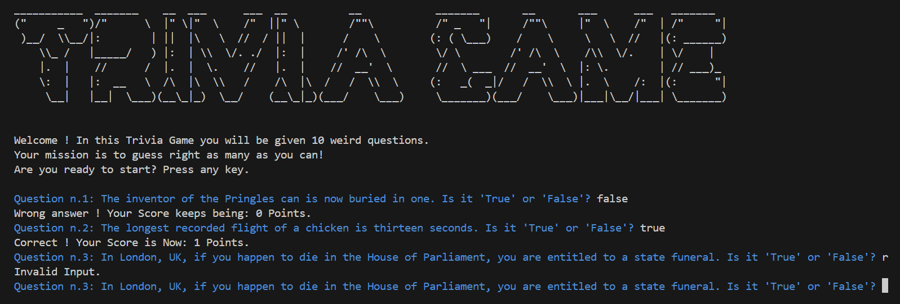

# Trivia Quiz Game

## Description

Welcome to the **Trivia Quiz Game**! This is an Object-Oriented Programming (OOP) Python project designed to test your knowledge with a fun and challenging quiz. The game presents you with a series of true/false questions, featuring some quirky and interesting facts. Your goal is to answer as many questions correctly as possible to accumulate the highest score.

## Features

- **10 Questions Per Quiz**: Each game consists of 10 questions. Try to get them all right!
- **Fun Facts**: Enjoy some amusing and surprising facts while playing.
- **Colorful Output**: The game uses `colorama` library for colorful text output to enhance the user experience.
- **ASCII Art**: A unique ASCII art logo adds a touch of personality to the game.
- **Reset Functionality**: Restart the game and play again if you wish, with your score and progress reset.

## Overview

Here's a brief overview of the main code components:

- **`Question` Class**: Represents a single random trivia question with its text and answer.
- **`Quiz_brain` Class**: Manages the quiz game logic, including asking questions, scoring, and restarting the game.
**`data` File**: To store the questions and answers available for this game.
- **`play_trivia.bat`**: A batch file to run the game easily on Windows.

## Installation

To run the Trivia Quiz Game, simply follow these steps:

1. **Download the repository**: Clone or download the repository from GitHub to your local machine.

2. **Run the game**: Open the downloaded repository folder and double-click the `play_trivia.bat` file to start the game.

   - The batch file will handle running the Python script and initializing the game.

## Example Output

Here is an example of what the game looks like in action:

---

Enjoy playing and have fun with the trivia quiz game! 🎉